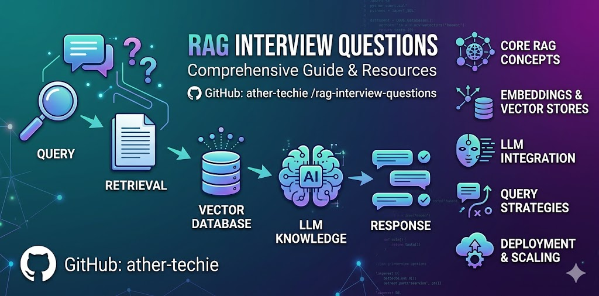

# RAG Interview Questions & Answers (2026) — Retrieval-Augmented Generation Interview Prep


[![Stargazers][stars-shield]][stars-url]
[![Forks][forks-shield]][forks-url]
[![License: MIT][license-shield]][license-url]
![Last Commit][commits-shield]
![Questions][questions-shield]
[![PRs Welcome][prs-shield]][prs-url]


<p align="center">
  
</p>

**204 RAG (Retrieval-Augmented Generation) interview questions and answers** for AI engineers, ML engineers, and GenAI/LLM developers. Covers all 12 RAG architectures, system design scenarios, vector databases, embeddings, chunking, reranking, evaluation, and the production failure modes that come up in real LLM engineering interviews.

⭐ **Star this repo** if it helps your interview prep — it keeps the project growing.

## What is RAG?

**Retrieval-Augmented Generation (RAG)** is an LLM architecture that grounds model responses in external knowledge: documents are chunked, embedded, and stored in a vector database; at query time the most relevant chunks are retrieved via vector search and passed to the LLM as context for generation. RAG reduces hallucination, keeps answers current without retraining, and is the most common production pattern for enterprise LLM applications — which is why it dominates AI engineer and GenAI system design interviews.

## Who is this for?

- **AI / ML engineers** preparing for RAG, LLM, or GenAI interview rounds
- **Software engineers** moving into LLM application development
- **Data scientists** facing RAG system design interviews
- **Hiring managers and interviewers** building question sets for GenAI roles

## 📚 Sections

[Overview & Concepts](#-overview--concepts) · [RAG Architecture Interview Questions](#-rag-architecture-interview-questions-12-types) · [Failure Modes & Production Issues](#-failure-modes--production-issues) · [Coming Soon](#-coming-soon)

### 📖 Overview & Concepts

| # | Topic | Purpose |
|---|-------|---------|
| 00a | [Roadmap](./00_overview/roadmap.md) | RAG maturity model, skill progression, and interview prep pathway |
| 00b | [RAG Taxonomy](./00_overview/rag_taxonomy.md) | Classification framework for all 12 architectures |
| 00c | [Learning Path](./00_overview/learning_path.md) | Structured curriculum and study plans |
| 00d | [System Design Principles](./00_overview/system_design_principles.md) | Production-grade architecture patterns |
| 01a | [Embeddings](./01_concepts/embeddings.md) | Embedding models, similarity metrics, and fine-tuning |
| 01b | [Chunking Strategies](./01_concepts/chunking_strategies.md) | Document splitting and chunk optimization |
| 01c | [Vector Databases](./01_concepts/vector_databases.md) | Storage, indexing, and hybrid search |
| 01d | [Retrieval Strategies](./01_concepts/retrieval_strategies.md) | Dense, sparse, hybrid, and advanced retrieval |
| 01e | [Reranking](./01_concepts/reranking.md) | Cross-encoders and precision filtering |
| 01f | [Evaluation Metrics](./01_concepts/evaluation_metrics.md) | RAGAS, NDCG, and production monitoring |
| 01g | [Prompt Injection Risks](./01_concepts/prompt_injection_risks.md) | Security and defense strategies |
| 01h | [Fine-Tuning for RAG](./01_concepts/fine_tuning.md) | When and how to fine-tune embeddings and rerankers |
| 01i | [Observability & Evaluation Ops](./01_concepts/observability_and_evaluation_ops.md) | LLM-as-judge, online metrics, tracing, drift alerts |
| 01j | [Multi-Tenancy & Access Control](./01_concepts/multi_tenancy_access_control.md) | Tenant isolation, document ACLs, leakage surfaces |

### ❓ RAG Architecture Interview Questions (12 Types)

| # | Topic | Questions |
|---|-------|-----------|
| 02.01 | [Naive / Basic RAG](./02_interview_bank/01-naive-rag.md) | 12 |
| 02.02 | [Advanced RAG](./02_interview_bank/02-advanced-rag.md) | 12 |
| 02.03 | [Modular RAG](./02_interview_bank/03-modular-rag.md) | 12 |
| 02.04 | [Agentic RAG](./02_interview_bank/04-agentic-rag.md) | 12 |
| 02.05 | [Graph RAG](./02_interview_bank/05-graph-rag.md) | 12 |
| 02.06 | [Corrective RAG (CRAG)](./02_interview_bank/06-corrective-rag.md) | 12 |
| 02.07 | [Self-RAG](./02_interview_bank/07-self-rag.md) | 12 |
| 02.08 | [Speculative RAG](./02_interview_bank/08-speculative-rag.md) | 12 |
| 02.09 | [Multi-modal RAG](./02_interview_bank/09-multimodal-rag.md) | 12 |
| 02.10 | [Long-context RAG](./02_interview_bank/10-long-context-rag.md) | 12 |
| 02.11 | [Adaptive RAG](./02_interview_bank/11-adaptive-rag.md) | 12 |
| 02.12 | [Structured / SQL RAG](./02_interview_bank/12-structured-rag.md) | 12 |

**RAG Architectures Total: 144 questions**

### ⚠️ Failure Modes & Production Issues

| # | Topic | Questions |
|---|-------|-----------|
| 03.01 | [Hallucination Despite Context](./03_failure_modes/01-hallucination_despite_context.md) | 10 |
| 03.02 | [Retrieval Failure](./03_failure_modes/02-retrieval_failure.md) | 10 |
| 03.03 | [Embedding Mismatch](./03_failure_modes/03-embedding_mismatch.md) | 10 |
| 03.04 | [Stale Index Problem](./03_failure_modes/04-stale_index_problem.md) | 10 |
| 03.05 | [Context Window Overflow](./03_failure_modes/05-context_window_overflow.md) | 10 |
| 03.06 | [Reranker Failure](./03_failure_modes/06-reranker_failure.md) | 10 |

**Failure Modes Total: 60 questions**

**Grand Total: 204 questions**

**Difficulty distribution: 25 Basic, 84 Intermediate, 95 Advanced**

All cited papers with arXiv/DOI links: [REFERENCES.md](./REFERENCES.md)

### 🔄 Coming Soon

Each planned section has a stub README describing what it will contain and how to contribute.

| # | Section | Status |
|---|---------|--------|
| 04 | [Patterns](./04_patterns/README.md) | Planned |
| 05 | [Graphs](./05_graphs/README.md) | Planned |
| 06 | [Labs](./06_labs/README.md) | Planned |
| 07 | [Simulator](./07_simulator/README.md) | Planned |
| 08 | [Evaluation](./08_evaluation/README.md) | Planned |
| 09 | [Tools](./09_tools/README.md) | Planned |
| 10 | [Decision System](./10_decision_system/README.md) | Planned |

---

## 🗺️ RAG Architecture Types Explained (12 Patterns + 6 Failure Modes)

**RAG Architectures (12 types):**
```
Naive RAG
  └── Chunk → Embed → Store → Retrieve → Generate

Advanced RAG
  └── Query rewriting + Hybrid search + Re-ranking

Modular RAG
  └── Plug-and-play pipeline components

Agentic RAG
  └── LLM decides when/how to retrieve (ReAct, FLARE)

Graph RAG
  └── Knowledge graph for entity-aware retrieval

Corrective RAG (CRAG)
  └── Evaluates retrieval quality, falls back to web search

Self-RAG
  └── Model trained to reflect, retrieve, and critique itself

Speculative RAG
  └── Small model drafts → Large model selects best

Multi-modal RAG
  └── Retrieve across text, images, tables, audio

Long-context RAG
  └── Stuff entire docs into large context windows

Adaptive RAG
  └── Query classifier routes to no-retrieval / single-hop / multi-hop

Structured / SQL RAG
  └── Text-to-SQL generation for relational database retrieval
```

**Production Failure Modes (6 critical issues):**
```
Hallucination Despite Context
  └── LLM ignores retrieved docs, generates false claims

Retrieval Failure
  └── Relevant chunks never surface due to semantic gap

Embedding Mismatch
  └── Query-doc embeddings in different semantic spaces

Stale Index Problem
  └── Index contains outdated information, answers are wrong

Context Window Overflow
  └── Too many/large chunks exceed context, forcing truncation

Reranker Failure
  └── Cross-encoder mis-ranks results, buries correct answers
```

---

## 💡 How to Use

**Four content types:**

1. **Overview & Concepts (00_overview/, 01_concepts/)** — Reference material, not Q&A
   - Read these first to build foundational understanding
   - Comparison tables, ASCII diagrams, code examples, and system design patterns
   - Use to answer conceptual questions and understand mechanisms deeply

2. **Interview Questions (02_interview_bank/)** — 12 questions per architecture
   - Each section contains interview-style Q&A with detailed answers
   - Every section: original 10 questions + Q11 on cost optimization + Q12 on security
   - Questions are tagged with difficulty: `[Basic]` `[Intermediate]` `[Advanced]`

3. **Failure Modes (03_failure_modes/)** — 10 questions per failure pattern
   - Six critical production failure scenarios with diagnostic Q&A
   - Use for system design rounds and production-readiness discussions

4. **CHEATSHEET (cheatsheets/CHEATSHEET.md)** — Quick reference
   - All 12 RAG types compared in one table
   - Use during phone screens or quick prep

**Study path:**
- **1-week prep:** Start with `00_overview/learning_path.md` → pick a track → follow the schedule
- **Phone screen:** `cheatsheets/CHEATSHEET.md` + Q1–Q5 from relevant architectures
- **System design round:** `00_overview/system_design_principles.md` + Q9–Q12 from all files + `03_failure_modes/` for production readiness
- **Deep prep:** Read `01_concepts/` files + all `02_interview_bank/` Q&A

---

## 🏷️ Topics Covered

Embeddings · Chunking strategies · Vector databases (FAISS, Pinecone, Weaviate, pgvector) · Hybrid search (BM25 + dense) · Reranking & cross-encoders · RAG evaluation (RAGAS, NDCG) · Agentic RAG · Graph RAG · Self-RAG & Corrective RAG · Multi-modal RAG · Text-to-SQL · Prompt injection & RAG security · Hallucination mitigation · LLM observability · Multi-tenancy & access control

---

## Contributing

This repo grows best with real-world signal. If you were asked a RAG question in an interview, **open a PR** — real questions are prioritized over synthetically generated ones.

See [CONTRIBUTING.md](CONTRIBUTING.md) for how to submit a question.

---

## Support

For issues, questions, or general feedback:

- Open an issue on [GitHub](https://github.com/ather-techie/rag-interview-questions/issues)
- Join the [Discord community](https://discord.gg/kSUE3CA9P)
- Contact: [ather.techie@gmail.com](mailto:ather.techie@gmail.com)

---

## License

[MIT](LICENSE)

---

*See [Contributing](#contributing) to add your interview experience to the repo.*

<!-- Badge References -->
[stars-shield]: https://img.shields.io/github/stars/ather-techie/rag-interview-questions?style=flat-square
[stars-url]: https://github.com/ather-techie/rag-interview-questions/stargazers
[forks-shield]: https://img.shields.io/github/forks/ather-techie/rag-interview-questions?style=flat-square
[forks-url]: https://github.com/ather-techie/rag-interview-questions/network/members
[license-shield]: https://img.shields.io/github/license/ather-techie/rag-interview-questions
[license-url]: LICENSE
[commits-shield]: https://img.shields.io/github/last-commit/ather-techie/rag-interview-questions
[questions-shield]: https://img.shields.io/badge/questions-204-blue
[prs-shield]: https://img.shields.io/badge/PRs-welcome-brightgreen
[prs-url]: CONTRIBUTING.md
