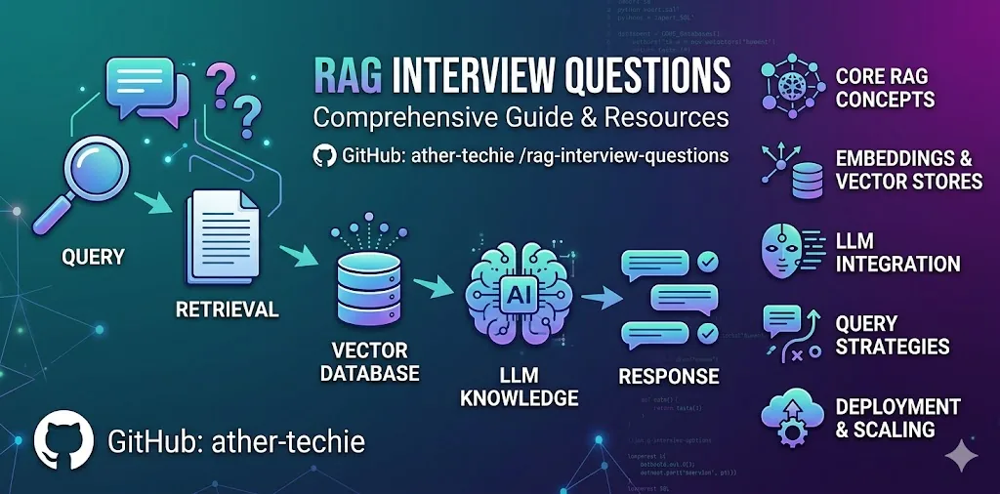

# RAG Interview Questions & Answers (2026) — Retrieval-Augmented Generation Interview Prep

[![Stargazers][stars-shield]][stars-url]
[![Forks][forks-shield]][forks-url]
[![License: MIT][license-shield]][license-url]
![Last Commit][commits-shield]
![Questions][questions-shield]
[![PRs Welcome][prs-shield]][prs-url]

<p align="center">
  
</p>

**603 RAG (Retrieval-Augmented Generation) interview questions and answers** for AI engineers, ML engineers, and GenAI/LLM developers. Covers all 52 RAG architectures, system design scenarios, vector databases, embeddings, chunking, reranking, evaluation, and the production failure modes that come up in real LLM engineering interviews.

⭐ **Star this repo** if it helps your interview prep — it keeps the project growing.

## 🚀 Start Here

| Link | Use it for |
|---|---|
| 🧾 [Cheatsheet](cheatsheets/CHEATSHEET.md) | All 52 RAG types compared in one table — best for a phone screen the same day |
| 🕹️ [Interactive Quiz Site][pages-url] | Flip through every Q&A as flashcards with a difficulty filter, right in the browser |
| 🗺️ [Learning Path](00_overview/learning_path.md) | Structured curriculum if you have more than a few days to prepare |
| ▶️ [Run Lab 01 in Colab](https://colab.research.google.com/github/ather-techie/rag-interview-system/blob/main/06_labs_py/01_naive_rag.ipynb) | Build a working RAG pipeline in your browser, no local setup |

### Quick Start (run the labs locally)

```bash
git clone https://github.com/ather-techie/rag-interview-system.git
cd rag-interview-system/06_labs_py

python3 -m venv .venv && source .venv/bin/activate   # Windows: .venv\Scripts\Activate.ps1
pip install -r requirements.txt

cp .env.example .env   # set AI_PROVIDER / AI_MODEL / AI_API_KEY
jupyter lab 01_naive_rag.ipynb
```

Prefer zero setup? Every lab notebook has an **Open in Colab** badge — see [Labs & Patterns](#-labs--patterns) below.

## What is RAG?

**Retrieval-Augmented Generation (RAG)** is an LLM architecture that grounds model responses in external knowledge: documents are chunked, embedded, and stored in a vector database; at query time the most relevant chunks are retrieved via vector search and passed to the LLM as context for generation. RAG reduces hallucination, keeps answers current without retraining, and is the most common production pattern for enterprise LLM applications — which is why it dominates AI engineer and GenAI system design interviews.

## Who is this for?

- **AI / ML engineers** preparing for RAG, LLM, or GenAI interview rounds
- **Software engineers** moving into LLM application development
- **Data scientists** facing RAG system design interviews
- **Hiring managers and interviewers** building question sets for GenAI roles

## 📚 Table of Contents

- [Getting Started](#-getting-started)
- [Core Concepts](#-core-concepts)
- [RAG Architecture Map (52 Types)](#-rag-architecture-map-52-types)
- [Failure Modes & Production Issues](#-failure-modes--production-issues)
- [Labs & Patterns](#-labs--patterns)
- [Coming Soon](#-coming-soon)
- [Study Plans](#-study-plans)
- [How to Use](#-how-to-use)
- [Topics Covered](#-topics-covered)
- [Contributing](#contributing)
- [Star History](#-star-history)
- [Support](#support)
- [More from the author](#-more-from-the-author)

### 🗺️ Getting Started

| # | Topic | Purpose | Questions |
|---|-------|---------|-----------|
| 00a | [Roadmap](./00_overview/roadmap.md) | RAG maturity model, skill progression, and interview prep pathway | – |
| 00b | [RAG Taxonomy](./00_overview/rag_taxonomy.md) | Classification framework for all 52 architectures across 4 axes | – |
| 00c | [Learning Path](./00_overview/learning_path.md) | Structured curriculum and study plans | – |
| 00d | [System Design Principles](./00_overview/system_design_principles.md) | Production-grade architecture patterns | – |

### 📖 Core Concepts

| # | Topic | Purpose | Questions |
|---|-------|---------|-----------|
| 01a | [Embeddings](./01_concepts/embeddings.md) | Embedding models, similarity metrics, and fine-tuning | 2 |
| 01b | [Chunking Strategies](./01_concepts/chunking_strategies.md) | Document splitting and chunk optimization | 2 |
| 01c | [Vector Databases](./01_concepts/vector_databases.md) | Storage, indexing, and hybrid search | 4 |
| 01d | [Retrieval Strategies](./01_concepts/retrieval_strategies.md) | Dense, sparse, hybrid, and advanced retrieval | 3 |
| 01e | [Reranking](./01_concepts/reranking.md) | Cross-encoders and precision filtering | – |
| 01f | [Evaluation Metrics](./01_concepts/evaluation_metrics.md) | RAGAS, NDCG, and production monitoring | 2 |
| 01g | [Prompt Injection Risks](./01_concepts/prompt_injection_risks.md) | Security and defense strategies | – |
| 01h | [Fine-Tuning for RAG](./01_concepts/fine_tuning.md) | When and how to fine-tune embeddings and rerankers | 7 |
| 01i | [Observability & Evaluation Ops](./01_concepts/observability_and_evaluation_ops.md) | LLM-as-judge, online metrics, tracing, drift alerts | 7 |
| 01j | [Multi-Tenancy & Access Control](./01_concepts/multi_tenancy_access_control.md) | Tenant isolation, document ACLs, leakage surfaces | 7 |
| 01k | [Document Ingestion & Parsing](./01_concepts/document_ingestion_and_parsing.md) | Parsing pipelines, layout extraction, and text normalization | 12 |
| 01l | [Knowledge Graph Construction](./01_concepts/knowledge_graph_construction.md) | Entity extraction, relation extraction, KG maintenance | 6 |
| 01m | [Caching Strategies](./01_concepts/caching_strategies.md) | Semantic cache, KV preloading, invalidation, cost/freshness trade-offs | 5 |
| 01n | [Cost Optimization](./01_concepts/cost_optimization.md) | Model tiering, prompt caching, quantization, batching | 4 |
| 01o | [Agentic Orchestration](./01_concepts/agentic_orchestration.md) | Tool-call loops, stopping criteria, ReAct vs. plan-and-execute, full pipeline architecture | 7 |
| 01p | [Multimodal Embeddings](./01_concepts/multimodal_embeddings.md) | CLIP, ImageBind, cross-modal alignment, vision-language models | 3 |
| 01q | [Conversational Memory Architecture](./01_concepts/conversational_memory_architecture.md) | Working/episodic/long-term memory, MemGPT paging, session detection | 3 |

**Core Concepts Total: 74 questions across 17 files**

### 🧭 RAG Architecture Map (52 Types)


```mermaid
flowchart TD
    RAG["52 RAG Architectures"] --> F["Foundational"]
    RAG --> AC["Adaptive & Self-Correcting"]
    RAG --> AG["Agentic & Reasoning"]
    RAG --> GR["Graph-Based"]
    RAG --> LC["Long-Context & Memory"]
    RAG --> MS["Multimodal & Structured"]
    RAG --> EF["Efficiency & Query Transform"]
    RAG --> SR["Security, Trust & Real-Time"]
    RAG --> TT["Training-Time / Parametric"]

    F --> F1["Naive · Advanced · Modular RAG"]
    F --> F2["DPR · ColRAG/ColBERT"]

    AC --> AC1["Adaptive RAG"]
    AC --> AC2["Corrective RAG (CRAG)"]
    AC --> AC3["Self-RAG · Astute RAG"]
    AC --> AC4["Speculative RAG"]

    AG --> AG1["Agentic RAG · FLARE"]
    AG --> AG2["Iterative / Multi-hop RAG"]
    AG --> AG3["Search-R1 · Auto-RAG/DeepRAG"]
    AG --> AG4["Deep Research · CoRAG · RQ-RAG"]

    GR --> GR1["Graph RAG · LightRAG"]
    GR --> GR2["HippoRAG · KAG"]
    GR --> GR3["GraphReader / GNN-RAG"]
    GR --> GR4["LazyGraphRAG"]

    LC --> LC1["Long-Context RAG · RAPTOR"]
    LC --> LC2["Contextual RAG · LongRAG"]
    LC --> LC3["Memory / Conversational RAG"]
    LC --> LC4["MemoRAG · Recursive Summarization"]

    MS --> MS1["Structured/SQL · Table-Aware RAG"]
    MS --> MS2["Multimodal RAG · VisRAG"]

    EF --> EF1["CAG · REFRAG"]
    EF --> EF2["RAG-Fusion · HyDE · Few-Shot Example RAG"]

    SR --> SR1["Verifiable/Citation RAG · SURGE"]
    SR --> SR2["Privacy-Preserving · Streaming/Real-Time RAG"]
    SR --> SR3["Agentic Web RAG · WebGPT · Tree of Thought RAG"]

    TT --> TT1["REALM · RETRO"]
    TT --> TT2["Atlas · Fusion-in-Decoder · RAFT"]
```

Full classification (retrieval control, data modality, feedback loop, scope, latency class) for all 52 types: [`00_overview/rag_taxonomy.md`](./00_overview/rag_taxonomy.md).

| # | Topic | Questions |
|---|-------|-----------|
| 02.01 | [Naive / Basic RAG](./02_interview_bank/01-naive-rag.md) | 12 |
| 02.02 | [Advanced RAG](./02_interview_bank/02-advanced-rag.md) | 12 |
| 02.03 | [Modular RAG](./02_interview_bank/03-modular-rag.md) | 12 |
| 02.04 | [Agentic RAG](./02_interview_bank/04-agentic-rag.md) | 15 |
| 02.05 | [Graph RAG](./02_interview_bank/05-graph-rag.md) | 12 |
| 02.06 | [Corrective RAG (CRAG)](./02_interview_bank/06-corrective-rag.md) | 12 |
| 02.07 | [Self-RAG](./02_interview_bank/07-self-rag.md) | 12 |
| 02.08 | [Speculative RAG](./02_interview_bank/08-speculative-rag.md) | 12 |
| 02.09 | [Multi-modal RAG](./02_interview_bank/09-multimodal-rag.md) | 12 |
| 02.10 | [Long-context RAG](./02_interview_bank/10-long-context-rag.md) | 12 |
| 02.11 | [Adaptive RAG](./02_interview_bank/11-adaptive-rag.md) | 12 |
| 02.12 | [Structured / SQL RAG](./02_interview_bank/12-structured-rag.md) | 12 |
| 02.13 | [RAPTOR](./02_interview_bank/13-raptor.md) | 12 |
| 02.14 | [Contextual RAG](./02_interview_bank/14-contextual-rag.md) | 12 |
| 02.15 | [LightRAG](./02_interview_bank/15-lightrag.md) | 12 |
| 02.16 | [RAFT](./02_interview_bank/16-raft.md) | 12 |
| 02.17 | [Cache-Augmented Generation (CAG)](./02_interview_bank/17-cache-augmented-generation.md) | 12 |
| 02.18 | [RAG-Fusion](./02_interview_bank/18-rag-fusion.md) | 12 |
| 02.19 | [Iterative / Multi-hop RAG](./02_interview_bank/19-iterative-multihop-rag.md) | 12 |
| 02.20 | [HippoRAG](./02_interview_bank/20-hipporag.md) | 12 |
| 02.21 | [Memory / Conversational RAG](./02_interview_bank/21-memory-conversational-rag.md) | 12 |
| 02.22 | [HyDE (Hypothetical Document Embeddings)](./02_interview_bank/22-hyde-rag.md) | 12 |
| 02.23 | [FLARE (Forward-Looking Active Retrieval)](./02_interview_bank/23-flare-rag.md) | 12 |
| 02.24 | [KAG (Knowledge Augmented Generation)](./02_interview_bank/24-kag.md) | 12 |
| 02.25 | [GraphReader / GNN-RAG](./02_interview_bank/25-graphreader-gnn-rag.md) | 12 |
| 02.26 | [REALM](./02_interview_bank/26-realm.md) | 12 |
| 02.27 | [RETRO](./02_interview_bank/27-retro.md) | 12 |
| 02.28 | [Atlas](./02_interview_bank/28-atlas.md) | 12 |
| 02.29 | [Fusion-in-Decoder (FiD)](./02_interview_bank/29-fusion-in-decoder.md) | 12 |
| 02.30 | [ColRAG / ColBERT](./02_interview_bank/30-colrag-colbert.md) | 5 |
| 02.31 | [Agentic Web RAG](./02_interview_bank/31-agentic-web-rag.md) | 5 |
| 02.32 | [Few-Shot Example RAG](./02_interview_bank/32-few-shot-example-rag.md) | 5 |
| 02.33 | [Verifiable / Citation RAG](./02_interview_bank/33-verifiable-citation-rag.md) | 5 |
| 02.34 | [Privacy-Preserving RAG](./02_interview_bank/34-privacy-preserving-rag.md) | 3 |
| 02.35 | [Streaming / Real-Time RAG](./02_interview_bank/35-streaming-realtime-rag.md) | 3 |
| 02.36 | [Table-Aware RAG](./02_interview_bank/36-table-aware-rag.md) | 3 |
| 02.37 | [Tree of Thought RAG](./02_interview_bank/37-tot-rag.md) | 3 |
| 02.38 | [DPR (Dense Passage Retrieval)](./02_interview_bank/38-dpr.md) | 3 |
| 02.39 | [WebGPT / Tool-Augmented LM](./02_interview_bank/39-webgpt-tool-augmented-lm.md) | 3 |
| 02.40 | [SURGE (Schema-Grounded RAG)](./02_interview_bank/40-surge-structured-grounded-rag.md) | 3 |
| 02.41 | [Recursive Document Summarization RAG](./02_interview_bank/41-recursive-document-summarization-rag.md) | 3 |
| 02.42 | [Search-R1 / Reasoning RAG](./02_interview_bank/42-search-r1-reasoning-rag.md) | 5 |
| 02.43 | [Deep Research / Agentic Research RAG](./02_interview_bank/43-deep-research-rag.md) | 5 |
| 02.44 | [MemoRAG](./02_interview_bank/44-memorag.md) | 5 |
| 02.45 | [LongRAG + Self-Route](./02_interview_bank/45-longrag.md) | 5 |
| 02.46 | [VisRAG](./02_interview_bank/46-visrag.md) | 5 |
| 02.47 | [LazyGraphRAG](./02_interview_bank/47-lazygraphrag.md) | 5 |
| 02.48 | [Astute RAG](./02_interview_bank/48-astute-rag.md) | 5 |
| 02.49 | [Auto-RAG / DeepRAG](./02_interview_bank/49-auto-rag-deeprag.md) | 5 |
| 02.50 | [CoRAG (Chain-of-Retrieval)](./02_interview_bank/50-corag.md) | 5 |
| 02.51 | [RQ-RAG](./02_interview_bank/51-rq-rag.md) | 5 |
| 02.52 | [REFRAG](./02_interview_bank/52-refrag.md) | 5 |

**RAG Architectures Total: 450 questions**

<details>
<summary><strong>One-line summary of every architecture</strong> (click to expand)</summary>

```
Naive RAG                          — Chunk → Embed → Store → Retrieve → Generate
Advanced RAG                       — Query rewriting + Hybrid search + Re-ranking
Modular RAG                        — Plug-and-play pipeline components
Agentic RAG                        — LLM decides when/how to retrieve (ReAct, FLARE)
Graph RAG                          — Knowledge graph for entity-aware retrieval
Corrective RAG (CRAG)              — Evaluates retrieval quality, falls back to web search
Self-RAG                           — Model trained to reflect, retrieve, and critique itself
Speculative RAG                    — Small model drafts → Large model selects best
Multi-modal RAG                    — Retrieve across text, images, tables, audio
Long-context RAG                   — Stuff entire docs into large context windows
Adaptive RAG                       — Query classifier routes to no-retrieval / single-hop / multi-hop
Structured / SQL RAG               — Text-to-SQL generation for relational database retrieval
RAPTOR                             — Recursively clusters and summarizes chunks into a multi-level tree
Contextual RAG                     — LLM-generated context prefix prepended to each chunk before embedding
LightRAG                           — Entity-relationship graph + dual-level (local + global) retrieval
RAFT                               — Fine-tunes the LLM generator on oracle + distractor documents
Cache-Augmented Generation (CAG)   — Preloads entire corpus into KV cache — no retrieval step at inference
RAG-Fusion                         — N query reformulations → N parallel retrievals → RRF merge → generation
Iterative / Multi-hop RAG          — Retrieve → reason → retrieve loops (IRCoT, Self-Ask) until a stopping criterion
HippoRAG                           — Personalized PageRank over an LLM-built knowledge graph for single-step multi-hop
Memory / Conversational RAG        — Tiered memory + history-aware query rewriting for multi-turn dialogue
HyDE                               — Embed an LLM-generated hypothetical answer to close the query-document gap
FLARE                              — Retrieve mid-generation when next-sentence tokens fall below a confidence threshold
KAG (Knowledge Augmented Gen.)     — Logical-form reasoning + KG/text mutual indexing for professional domains
GraphReader / GNN-RAG              — Agentic graph-of-notes traversal / GNN-retrieved reasoning subgraphs
REALM (training-time)              — Retriever learned end-to-end during masked-LM pre-training
RETRO (training-time)              — Chunked cross-attention over a trillion-token frozen datastore
Atlas (training-time)              — Jointly-trained Contriever + FiD; few-shot knowledge learning
Fusion-in-Decoder (FiD) (training) — Encode passages separately, fuse them in the decoder
ColRAG / ColBERT                   — Multi-vector late interaction (MaxSim); each token gets its own embedding
Agentic Web RAG                    — Live web search as retrieval backend; real-time freshness + citation extraction
Few-Shot Example RAG               — Retrieves query→answer demonstrations rather than documents; plugged into the prompt
Verifiable / Citation RAG          — Inline citations mapped to specific passages; post-hoc attribution verification
Privacy-Preserving RAG             — On-device embedding, differential privacy, federated retrieval for zero-trust corpora
Streaming / Real-Time RAG          — Continuous index updates from Kafka / CDC; freshness window in seconds
Table-Aware RAG                    — Structured retrieval over semi-structured tables; row/column linearization or SQL hybrid
Tree of Thought RAG                — ToT reasoning branches with conditional per-hypothesis retrieval
DPR (Dense Passage Retrieval)       (foundational) — Bi-encoder trained with question–passage contrastive loss
WebGPT / Tool-Augmented LM          (foundational) — RLHF-trained to issue browser actions (search/click/quote)
SURGE (Schema-Grounded RAG)        — tool_use schema-constrained extraction + per-field NLI grounding validation
Recursive Doc. Summarization RAG   — 4-level summary tree (chunk→section→doc→corpus); routes queries to the right level
Search-R1 / Reasoning RAG          — RL-trained LLM interleaves reasoning and self-issued search calls
Deep Research / Agentic Research   — Parallel plan-search-read-synthesize sub-agents produce a long-form cited report
MemoRAG                            — Compresses the corpus into a global memory that drafts query-time retrieval clues
LongRAG + Self-Route               — Retrieves large (~4K-token) grouped units; Self-Route picks RAG vs. long-context
VisRAG                             — Embeds and reads document pages as images end-to-end via a VLM
LazyGraphRAG                       — Cheap noun-phrase co-occurrence graph at index time, LLM work deferred to query time
Astute RAG                         — Elicits the LLM's own parametric knowledge, reconciles it with retrieved passages
Auto-RAG / DeepRAG                 — Decides retrieve-vs-reason at every step, not once up-front
CoRAG (Chain-of-Retrieval)         — Rejection-sampled retrieval chains; chain length is a test-time compute knob
RQ-RAG                             — Fine-tunes the LLM to chain query-refinement operations via special tokens
REFRAG                             — Compresses chunks into embeddings, RL policy expands only the important ones
```

</details>

### ⚠️ Failure Modes & Production Issues

| # | Topic | Questions |
|---|-------|-----------|
| 03.01 | [Hallucination Despite Context](./03_failure_modes/01-hallucination_despite_context.md) | 10 |
| 03.02 | [Retrieval Failure](./03_failure_modes/02-retrieval_failure.md) | 10 |
| 03.03 | [Embedding Mismatch](./03_failure_modes/03-embedding_mismatch.md) | 10 |
| 03.04 | [Stale Index Problem](./03_failure_modes/04-stale_index_problem.md) | 10 |
| 03.05 | [Context Window Overflow](./03_failure_modes/05-context_window_overflow.md) | 10 |
| 03.06 | [Reranker Failure](./03_failure_modes/06-reranker_failure.md) | 10 |
| 03.07 | [Conversational Context Drift](./03_failure_modes/07-conversational_context_drift.md) | 10 |
| 03.08 | [Cascading Retrieval Failure](./03_failure_modes/08-cascading_retrieval_failure.md) | 4 |
| 03.09 | [Semantic Cache Leakage](./03_failure_modes/09-semantic_cache_leakage.md) | 5 |

**Failure Modes Total: 79 questions**

**Grand Total: 603 questions**

**Difficulty distribution: ~72 Basic, ~248 Intermediate, ~259 Advanced**

All cited papers with arXiv/DOI links: [REFERENCES.md](./REFERENCES.md)

### 🔬 Labs & Patterns

Hands-on Jupyter notebooks and composition pattern guides:

| # | Section | Contents |
|---|---------|----------|
| 04 | [Patterns](./04_patterns/README.md) | Router + fallback, fan-out/fan-in, migration path, anti-patterns |
| 06 | [Labs](./06_labs_py/README.md) | 5 Jupyter notebooks: Naive RAG → Hybrid RAG → Reranker → RAGAS Evaluation → Agentic RAG. Each has an [](https://colab.research.google.com/github/ather-techie/rag-interview-system/blob/main/06_labs_py/01_naive_rag.ipynb) badge — no local setup needed |
| 08 | [Evaluation](./08_evaluation/README.md) | Golden dataset construction guide + RAGAS CI harness |
| 09 | [Tools](./09_tools/README.md) | Eval & observability tool comparison (Ragas, TruLens, DeepEval, LlamaIndex eval, LangChain eval); vector DB & framework comparisons still planned |

### 🔄 Coming Soon

| # | Section | Status |
|---|---------|--------|
| 05 | [Graphs](./05_graphs/README.md) | Planned |
| 07 | [Simulator](./07_simulator/README.md) | Planned |
| 10 | [Decision System](./10_decision_system/README.md) | Planned |

---

## 🗓️ Study Plans

### 1 Day (phone screen tomorrow)

| Step | Do this |
|---|---|
| 1 | Skim [`cheatsheets/CHEATSHEET.md`](cheatsheets/CHEATSHEET.md) — all 52 types compared |
| 2 | Read Q1–Q5 of [Naive RAG](02_interview_bank/01-naive-rag.md), [Advanced RAG](02_interview_bank/02-advanced-rag.md), [Agentic RAG](02_interview_bank/04-agentic-rag.md) |
| 3 | Read [`00_overview/roadmap.md`](00_overview/roadmap.md) for the big picture |

### 1 Week (first-round interview)

| Day | Focus |
|---|---|
| 1–2 | [`01_concepts/`](01_concepts) — embeddings, chunking, vector DBs, retrieval, reranking |
| 3–4 | [`02_interview_bank/`](02_interview_bank) — all 52 architectures, all questions |
| 5 | [`03_failure_modes/`](03_failure_modes) — the 9 production failure patterns |
| 6 | Run [Labs 01–03](06_labs_py) — naive → hybrid → reranker, hands-on |
| 7 | [`00_overview/system_design_principles.md`](00_overview/system_design_principles.md) + a mock system design round |

### 4 Weeks (deep prep / career switch)

| Week | Focus |
|---|---|
| 1 | Core concepts ([`01_concepts/`](01_concepts)) + Labs 01–02 |
| 2 | Full interview bank ([`02_interview_bank/`](02_interview_bank)) — all 52 architectures |
| 3 | Failure modes + [`08_evaluation/`](08_evaluation) + Labs 03–04 |
| 4 | Agentic RAG deep dive ([`01_concepts/agentic_orchestration.md`](01_concepts/agentic_orchestration.md)) + Lab 05 + mock interviews using the [Interactive Quiz Site][pages-url] |

---

## 💡 How to Use

**Content types:**

1. **Getting Started (00_overview/)** — Roadmap, taxonomy, learning path, and system design principles for orientation

2. **Core Concepts (01_concepts/)** — Reference material, mostly not Q&A
   - Read these first to build foundational understanding
   - Each file opens with a plain "What is X?" definition before going deep
   - Comparison tables, ASCII diagrams, code examples, and system design patterns

3. **Interview Questions (02_interview_bank/)** — 12 questions per architecture
   - Every section: original 10 questions + Q11 on cost optimization + Q12 on security
   - Questions are tagged with difficulty: `[Basic]` `[Intermediate]` `[Advanced]`

4. **Failure Modes (03_failure_modes/)** — 10 questions per failure pattern
   - Nine critical production failure scenarios with diagnostic Q&A
   - Use for system design rounds and production-readiness discussions

5. **Labs (06_labs_py/)** — 5 runnable notebooks turning the Q&A into working pipelines

See [Study Plans](#-study-plans) above for how to sequence these under time pressure.

---

## 🏷️ Topics Covered

Embeddings · Chunking strategies · Vector databases (FAISS, Pinecone, Weaviate, pgvector) · Hybrid search (BM25 + dense) · Reranking & cross-encoders · RAG evaluation (RAGAS, NDCG) · Agentic RAG · Graph RAG · Self-RAG & Corrective RAG · Multi-modal RAG · Text-to-SQL · Prompt injection & RAG security · Hallucination mitigation · LLM observability · Multi-tenancy & access control · Knowledge graph construction · Semantic caching · Cost optimization · Privacy-preserving retrieval · Streaming / real-time indexing · Citation & attribution · ColBERT multi-vector retrieval · Reasoning RAG & RL-trained search (Search-R1) · Deep Research agents · Vision-native RAG (VisRAG)

---

## Contributing

This repo grows best with real-world signal. If you were asked a RAG question in an interview, [open an issue](https://github.com/ather-techie/rag-interview-system/issues/new/choose) or a PR — real questions are prioritized over synthetically generated ones.

See [CONTRIBUTING.md](CONTRIBUTING.md) for the format, and [CODE_OF_CONDUCT.md](CODE_OF_CONDUCT.md) for community guidelines.

---

## ⭐ Star History

[](https://star-history.com/#ather-techie/rag-interview-system&Date)

---

## Support

For issues, questions, or general feedback:

- Open an issue on [GitHub](https://github.com/ather-techie/rag-interview-system/issues)
- Join the [Discord community](https://discord.gg/FqEFjRT3Y)
- Contact: [ather.techie@gmail.com](mailto:ather.techie@gmail.com)

---

## 🔗 More from the author

- [ai-agents-design-patterns](https://github.com/ather-techie/ai-agents-design-patterns) — design patterns for building production AI agents
- [ai-system-design-interview](https://github.com/ather-techie/ai-system-design-interview) — system design interview prep for AI/ML platforms

---

## License

[MIT](LICENSE)

---

*See [Contributing](#contributing) to add your interview experience to the repo.*

<!-- Badge References -->
[stars-shield]: https://img.shields.io/github/stars/ather-techie/rag-interview-system?style=flat-square
[stars-url]: https://github.com/ather-techie/rag-interview-system/stargazers
[forks-shield]: https://img.shields.io/github/forks/ather-techie/rag-interview-system?style=flat-square
[forks-url]: https://github.com/ather-techie/rag-interview-system/network/members
[license-shield]: https://img.shields.io/github/license/ather-techie/rag-interview-system
[license-url]: LICENSE
[commits-shield]: https://img.shields.io/github/last-commit/ather-techie/rag-interview-system
[questions-shield]: https://img.shields.io/badge/questions-603-blue
[prs-shield]: https://img.shields.io/badge/PRs-welcome-brightgreen
[prs-url]: CONTRIBUTING.md
[pages-url]: https://ather-techie.github.io/rag-interview-system/
